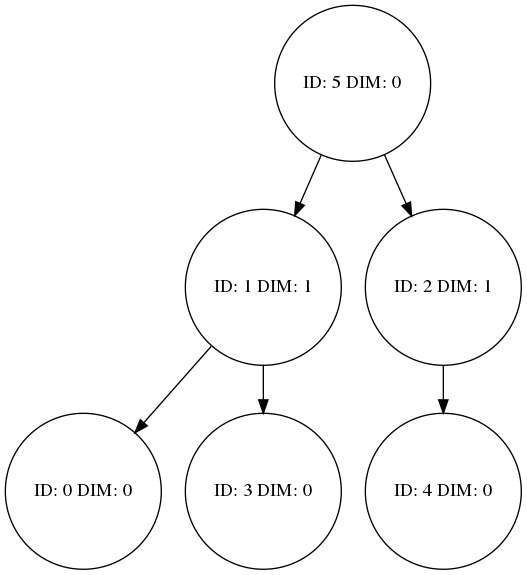

# kdtree

Simple implementation of kdtree. Support using Graphviz to draw the structure of kdtree.

## require

* c++11

## usage

```c++
#include <iostream>
#include <vector>
#include <kdtree.h>

using namespace std;


int main() {

    std::vector<std::vector<double >> test_data
    {
        {2,3},{5,4},{9,6},{4,7},{8,1},{7,2}
    };

    kt::kdtree<double> kd(test_data, kt::DEPTH);

    cout  << "NearestSearch\n";
    auto idxs = kd.NearestSearch( {2, 4.5}, 2);

    for(auto idx: idxs)
    {
        cout << "id: "<< idx<<" coor: "<<test_data[idx][0]<<" " << test_data[idx][1]<< endl;
    }


    cout  << "RadiusSearch\n";
    idxs = kd.RadiusSearch( {2, 4.5}, 3.5);

    for(auto idx: idxs)
    {
        cout << "id: "<< idx<<" coor: "<<test_data[idx][0]<<" " << test_data[idx][1]<< endl;
    }

    kd.ToDot(true); // save tree
}
``` 

then output
```
NearestSearch
id: 0 coor: 2 3
id: 1 coor: 5 4
RadiusSearch
id: 1 coor: 5 4
id: 3 coor: 4 7
id: 0 coor: 2 3
```

PNG file can be found in workspace folder

;

## comparison

Data size: 50000 × 3
``` 
Build tree cost: 0.128715s
```

Nearest Search for K=10
``` 
Nearest Search: 
total_time_native: 23.0044s
total_time_kdtree: 2.5603s
```

Radius Search for Radius = 10000
``` 
Radius Search: 
total_time_native: 29.2782s
total_time_kdtree: 11.9156s
```
